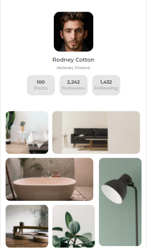
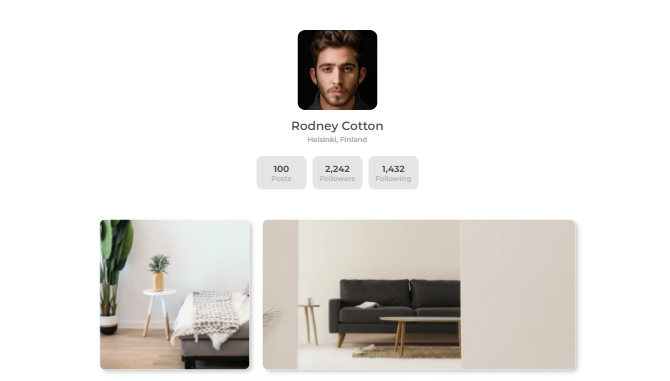

<!-- Please update value in the {}  -->

<h1 align="center">My Galery</h1>

   Solution for a challenge from  <a href="http://devchallenges.io" target="_blank">Devchallenges.io</a>.

  <h3>
    <a href="https://github.com/angelicabolivar/my_gallery">
      Demo
    </a>
     | 
    <a href="https://angelicabolivar.github.io/my_gallery/">
      Solution
    </a>
     | 
    <a href="https://devchallenges.io/challenges/gcbWLxG6wdennelX7b8I">
      Challenge
    </a>
  </h3>

<!-- TABLE OF CONTENTS -->

## Table of Contents

- [Overview](#overview)
  - [Built With](#built-with)
- [Contact](#contact)

<!-- OVERVIEW -->

## Overview

- What was your experience?
- What have you learned/improved?

### Built With

<!-- This section should list any major frameworks that you built your project using. Here are a few examples.-->

- [HTML]
- [CSS]

## Contact

- GitHub [@angelicabolivar](https://https://github.com/angelicabolivar)
- Twitter [@angelica_vbc](https://twitter.com/angelica_vbc)
